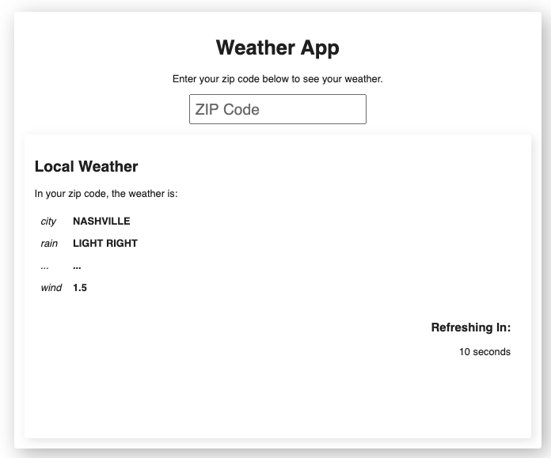

# Weather App

Homework exercise to showcase front end skills.



## The Goal

We already have a basic structure in place: JSX, CSS, and an api client to get current weather data. Now bring it to life using React! Create a weather app that does the following:

- Displays the current weather for a given zip code using the **OpenWeatherMap** API [https://openweathermap.org/current](https://openweathermap.org/current)
- Updates the weather data every 10 seconds (with a ticking countdown clock until the next refresh)

Note that the existing code is an aid, but don't let it constrain you. Feel free to add new components, remove existing ones, and restructure things as you see fit. Also feel free to change any and all CSS to acheive the look you want and add any functionality that you deem valuable.

- From a TECHNICAL perspective, we're looking for a effective, efficient, easy-to-reason-about app that we'd feel comfortable putting into production.
- From a PRODUCT perspective, we want the app to be intuitive, attractive and resillient to errors of any kind.

## The Weather Data

Note that there is some rate limiting and account monitoring, so if you accidentally call the API excessively (for example, in a loop) you may get blocked / banned and require a new account. Reach out if this happens, and we'll unblock you.

Example API Response Body:

```
{
    "base": "stations",
    "clouds": {
        "all": 90
    },
    "cod": 200,
    "coord": {
        "lat": 36.1504,
        "lon": -86.7916
    },
    "dt": 1610367250,
    "id": 0,
    "main": {
        "feels_like": 21.09,
        "humidity": 74,
        "pressure": 1026,
        "temp": 29.73,
        "temp_max": 30.2,
        "temp_min": 28.99
    },
    "name": "Nashville",
    "sys": {
        "country": "US",
        "id": 4609,
        "sunrise": 1610369886,
        "sunset": 1610405514,
        "type": 1
    },
    "timezone": -21600,
    "visibility": 10000,
    "weather": [
        {
            "description": "overcast clouds",
            "icon": "04n",
            "id": 804,
            "main": "Clouds"
        }
    ],
    "wind": {
        "deg": 10,
        "speed": 6.91
    }
}
```

## How to Submit

- Replace this README with one that includes:
  - a screenshot of the final product
  - a brief written description of your changes
  - instructions to run locally
  - bonus points for also providing instructions to run a dockerized production build
- Host a Git repo on either Github or Gitlab for the project. This should be a private repo to avoid exposing the API key.
- Give your reviewer at Ternary access to the repo (email them to ask for their applicable username when ready).

## Run the app locally

`npm install`

`npm start`

Runs the app in the development mode.
Open [http://localhost:9001](http://localhost:9001) to view it in the browser.
